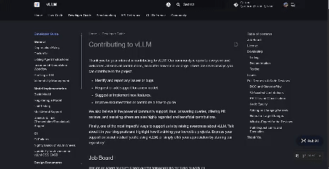
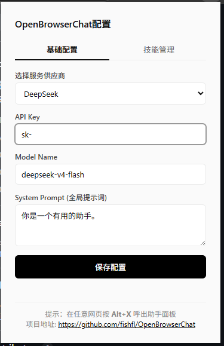
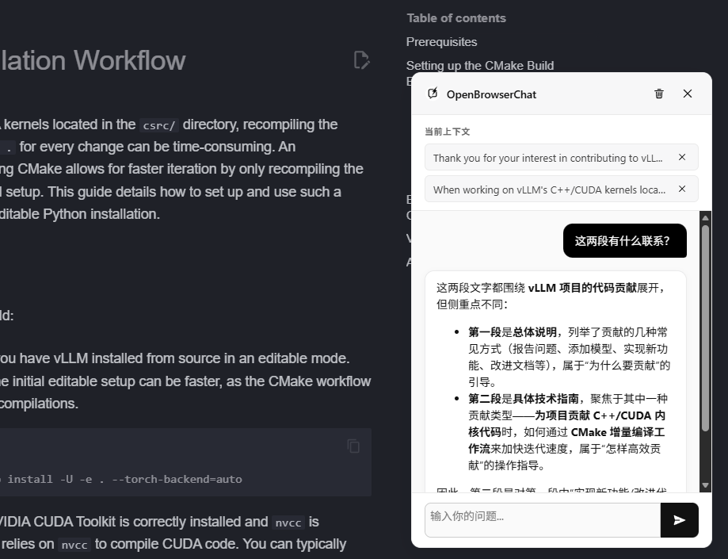

# OpenBrowserChat

OpenBrowserChat 是一款基于 Chrome 的开源浏览器扩展，旨在将任何网页内容轻松添加为上下文，并使用各种主流的大语言模型（LLM）进行问答或对话。并且，它还内置了 **SKILL（技能）管理体系**，让你可以将特定的 Prompt 定义为自定义技能指令并快速调用。

## ✨ 核心特性



*(演示：在阅读说明文档时，随时框选多段不同位置的上下文，加入到 AI 对话面版中进行综合发问)*

- ⌨️ **全局唤出助手**: 通过快捷键 `Alt+V` 可以随时在当前网页中唤出 AI 助手面板，无需离开当前浏览流程。
- 🚀 **一键添加上下文**: 在网页中选中任何文本，使用快捷键 `Alt+V` （Mac 同理）即可立即将选中的文本捕获为对话上下文。
- 🧠 **广泛的模型支持**: 通过适配通用的 OpenAI 接口格式，完美支持大量主流模型及提供商（包含自定义 Endpoint 支持）：
  - OpenAI 
  - Google (Gemini)
  - DeepSeek
  - 月之暗面 (Kimi)
  - 阿里百炼 (DashScope)
  - OpenRouter
- 🛠 **支持文本类 SKILL 技能系统**: 
  - 支持上传 `.md` 格式文件配置技能（兼容带有 YAML Frontmatter 格式的配置）。
  - 在助手输入框中输入 `/` 即可触发技能补全列表；支持通过 `/skill-name` 快速携带特定增强提示词调用 AI（例如快速整理笔记、翻译、结构化输出等）。
- 📝 **Markdown 渲染**: 助手消息输出全面支持 Markdown 的语法渲染（代码高亮/表格/列表/加粗等）。
- 🎨 **多 Tab 同步**: 支持浏览器多 Tab 之间状态、对话历史与上下文的同步切换管理。

## 📦 安装与配置

### 方式一：下载 Release 压缩包（推荐）

1. 前往本仓库的 [Releases](https://github.com/fishfl/OpenBrowserChat/releases) 页面。
2. 下载最新版本的 `.zip` 压缩文件并解压到一个文件夹中。
3. 打开 Chrome，在地址栏输入 `chrome://extensions/` 访问扩展程序管理页。
4. 打开右上角的 **开发者模式** (Developer mode)。
5. 点击 **加载已解压的扩展程序** (Load unpacked)，然后选择刚才解压的文件夹即可。

### 方式二：浏览器插件商店安装
*敬请期待：目前正在准备将本扩展发布至 Google Chrome Extension Store 和 Microsoft Edge Add-ons 商店，届时可以直接通过商店一键安装并自动更新。*

### 方式三：本地源码编译安装

1. **克隆项目到本地**
   ```bash
   git clone https://github.com/fishfl/OpenBrowserChat.git
   cd OpenBrowserChat
   ```

2. **安装依赖并打包**
   前提要求：需要你的环境中已安装 `Node.js`。
   ```bash
   npm install
   npx webpack
   ```
   *编译成功后，代码将会输出到 `dist/` 文件夹中*。

3. **在浏览器中加载扩展**
   - 打开 Chrome (或 Edge/Brave 等基于 Chromium 的浏览器)，进入扩展程序管理页：`chrome://extensions/`
   - 打开右上角的 **开发者模式** (Developer mode)。
   - 点击 **加载已解压的扩展程序** (Load unpacked) 选项。
   - 选中本项目中打包后的整个文件夹所在的路径（或者将带有 `manifest.json` 配置的根目录作为插件目录载入）进行安装。

## ⚙️ 如何使用与配置

1. **设置模型信息**: 
   - 扩展安装成功后，点击浏览器右上角的扩展图标打开配置页面。
   - 选择您常用的 API 提供商（或者输入自定义 URL）。
   - 填入对应提供商的 API Key 与 Model Name。
   - （可选）你可以在此处调整该助手的全局 System Prompt。
   - 点击 **保存配置**。

<p align="center">
  
</p>

2. **导入功能技能 (Skills)**（可选）:
   - 在配置面板点击上方 **技能管理** 标签页。
   - 准备一些 `.md` 文件（内容包含你自定义的 Prompt）。
   - 上传这些 Markdown 文件即可将其注册为应用系统的内置技能项，你可以随时在对话中通过输入 `/` 快速检索并应用。

3. **捕获与问答**(注意：刚安装后，老网页先刷新):
   - 在浏览器浏览任何网页，用鼠标框选你需要作为背景知识的文本。
   - 按下快捷键 `Alt + V` ，文本就会自动添加到上下文区中，并且聊天框会自动拉起。
   - 输入你的提问即可让 AI 根据该上下文为你解答！

<p align="center">
  
</p>

## 💡 开发参考

项目的核心模块主要分为以下几块：

- **`manifest.json`**: 插件环境配置声明，包括权限申请（`activeTab`, `storage`, `scripting` 等）及入口定义。
- **背景脚本 (`background.ts`)**: 守护后台，主要用于接收热键（Commands）响应并将动作派发给内容脚本。
- **内容脚本 (`content.ts`)**: 注入到实际页面的脚本，负责渲染侧边栏对话 UI（通过注入元素并隔离样式以防影响宿主网页），处理用户交互，并且通过发起后端网络请求流式读取（Stream API）并展示大型模型返回的内容。
- **弹窗 UI (`popup.ts/html`)**: 这是用户点击扩展图标时打开的界面，包含基础的 API Setting 连接配置以及技能管理逻辑的绑定。

## 📄 许可证

MIT License. 详情请参阅项目中的 [LICENSE](LICENSE) 文件（如有创建）。欢迎贡献代码和反馈 Issue！